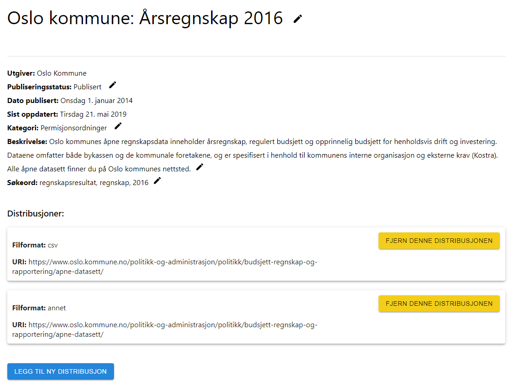

# User Guide
This is a description of how to use the data catalogue containing catalogue items which for now are datasets and coordinations.

## Data catalogue
On the main page called 'Datakatalog' a list of catalogue item cards are shown, as seen in the picture below. Each card is a brief introduction to the catalogue item showing title, short description, statuses and publisher. For coordination it also shows the municipalities participating in the coordination, and for datasets it shows the data format of the distributions. The list is implemented with infinite scroll which makes it possible to scroll and continue to load in new items. The drop down menu (1) in the top right corner is used to choose which type of items that are shown in the list. The options in the drop down are: all, datasets and coordinations.

The catalogue offers functionality such as searching on title, description and tags for the catalogue items using the search bar (2) on the top. It is also possible to sort the catalogue items using the buttons (3) just underneath the search bar. It can be sorted on title and the published. When the arrow in the button is pointing up it is ascending (A -> Z, oldest first) and when the arrow is pointing down it is descending (Z -> A, newest first).
The catalogue also offers the convenient functionality of filtering the catalogue items. This is done by clicking the checkbox to the left of the filter label. It is possible to filter on different publishers(4), categories(5) and availability statuses. It is possible to show more filters inside each filter box by clicking the down arrow (6) in the bottom of the box. It filters inclusively so if two filters in same box is checked it will show results for both of them in the list. The categories filter also offers sub categories and it is possible to expand a category showing sub categories by clicking on the little down arrow (7) to the right of the category. The number (8) behind a category will show how many catalogue items that have that category and sub categories of that category.

## Detailed page
When a card in the list is clicked a page showing more information about that catalogue item is opened. In a detailed page about a dataset it will show statuses on the top, see the picture below. The first describes the publication status and is one of 'Publisert', 'Publisering planlagt' and 'Ikke publisert'. The second describes the access level and is one of 'Kan deles offentlig', 'Begrenset offentlighet' and 'Unntatt offentlighet'. The third describes the coordination status and is one of 'Samordnet', 'Under samornding' and 'Ikke samordnet'. If it is coordinated it is possible to click the status tag and go directly to the coordination. Then it is shown some standard meta data about the dataset including title, publisher, date of publication, date of last update, category, description and tags. If the dataset is published it will be a list of distributions having a title, format and a clickable link to the distribution. 

If logged in and the dataset is not yet published it is possible to show interest in the dataset by clicking the 'Etterspør datasett' button, see \autoref{fig:etterspør}. 

There is also potentially a list of use cases associated to the dataset as seen in the picture below. 

If logged in it is also possible subscribe to the dataset to get notifications when it is changed, added more distributions, joins a coordination etc. It is possible to add a link and description for what the dataset is used for, as in the picture below. The subscription will then show up as a use case. 

If the buttons 'Diskuter dette datasettet' and 'Gi tilbakemeldinger på dette datasettet', see the picture below, is clicked a new window with a GitLab discussion forum specific for that dataset is opened. A brief introduction to the functionality on GitLab is described in the end of the user guide.

If the card that was clicked on rather was a coordination there is opened a very similar page as the one for the dataset, see the picture below, though there are some differences. 

The detailed coordination page also has a list of datasets that is currently participating in the coordination, see the picture below. These are clickable and will open a detailed page about that specific dataset. 

If logged in it is also possible to propose a coordination to a publisher that is not yet participating in the coordination, see the picture below. 

If logged in as a municipality user it is possible to send an application to join a coordination. The application will include a reason and a specific dataset, as seen in the picture below.

## User functionality and notifications

When the 'Logg inn' button in the top right corner is clicked it will open the login page, as seen in the picture below. The login system is so far very simple, the only thing needed is a username. If a username that already exists is entered it logs onto that user. If the username is new a new user is created with that username. 

When logged the catalogue is opened and the username and a bell icon will appear in the top right corner, as seen in the picture below. When the bell icon is clicked a dialog showing the most recent notifications will appear. Each notification refers to a catalogue item and also has a description and timestamp. If a notification is clicked a detailed page for the catalogue item is opened.

A normal user will be able to show interest in datasets and subscribe to datasets and coordinations. Thus also be able to receive notifications for subscriptions.
For a user to be able to create and edit catalogue items the user has to be connected to a municipality. This is done by logging into a username on the form: '[Name]\_[Municipality]\_kommune'. For example the user with the username 'test\_trondheim\_kommune' will have access to Trondheim's catalogue items. When logged in as a municipality user two more pages in the navigation bar will appear.

On the page 'Mine data' is a list of datasets published by the publisher, see the picture below. If the dataset is not yet published there will be a interest counter in the bottom of the dataset card. It is possible to show coordinations by using the drop down menu in the top right corner. 

When a user that is connected to the municipality opens a catalogue item the user is able to edit the catalogue item by clicking the pencil icon to the right, see the picture below. It is also possible to add and remove distributions using the buttons 'Legg til ny distribusjon' and 'Fjern denne distribusjonen'. 

If it is a coordination the user can also accept or decline incoming applications for joining the coordination, see the picture below.

On the page 'Publiser data', see the picture below, it is possible to create new datasets and coordinations. A dataset is required to have a title, description, category, access level and publication status. It is also possible to add tags and distributions to the dataset. It is also a choice to send an application to a coordination. When all required fields is filled it is just to click the 'Opprett datasett' button. It will take some seconds for it to create the dataset then it will show a response and take you to the detailed page for the dataset if successful. Creating a coordination is very similar and in addition it is possible to add a dataset the publisher have already published. 

In the tab 'Importer datasett', see the picture below, it is possible to import a dataset from a DCAT-AP-NO file located on a URL. Especially for the site data.norge.no the application supports to import using the URL directly to the human readable page of a dataset or by simply pasting in the id of the dataset found in the end of the URL on the form 'fff3a365-cd82-448e-97a2-05aade8f6cf1'.

## GitLab forum

The application is connected to a instance of GitLab used as a discussion forum for the catalogue items. When a new publisher is created a new group is created in GitLab. When a publisher creates a new catalogue item is also created a new project for that catalogue item in GitLab and put in the corresponding group. Datasets is put in the publisher's group and coordinations is put in a group named 'samordninger'. When a user clicks on the 'Diskuter dette datasettet'/'Diskuter denne samordningen' button on a catalogue item a GitLab board is opened potentially containing multiple issued across the lists named: 'Endringsforslag', 'Feil', 'Tilbakemelding' and 'Erfaring' as in picture below. By clicking the '+' icon in the top right corner of a list it is possible to easily create a new issue. It is also possible to click on the title of an issue to read more detailed description, look at files and comment on the issue. 

When a user rather clicks on the 'Gi tilbakemeldinger på dette datasettet'/'Gi tilbakemeldinger på denne samordningen' button the GitLab site is opened and it is possible to create a new issue, see the picture below. Important things to enter is the title, description and a appropriate label for the feedback. 

It is also possible to navigate the GitLab site to easily find other datasets to discuss using the system in the top middle of the site, see the picture below. Bear in mind that it might not be possible to post new issues if you have not yet created a user for GitLab even though you have a user on the main site.

